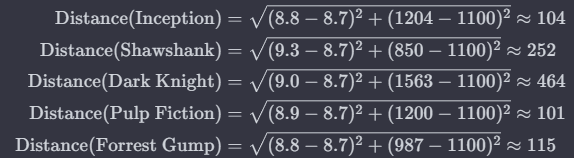

# Classification

## Classification - An overview

### Classification 
Classification in data mining is a supervised learning technique that involves *assigning predefined labels or categories to data instances based on their characteristics*. The primary goal of classification is to build a model that can accurately predict the class or category of new, unseen data based on the patterns learned from a labeled training dataset.

>***Note(In Hindi):*** Patterns ya charaterstics learn kar ke kisi bhi data ko labels ya ek class assign karna hi classfication hai.  

**For example:** Spam Detection in Email Service - Based on spam and non-spam training data , a new email is classified as spam or non-spam.

### Classification is a two step process:
1. A learning step (A classification model is constructed)
2. A classification step (Model is used to predict class)

### Applications of Classification Models
- **Product Cart Analysis:** To associate items into groups.
- **Weather Pattern Prediction**
- **Disease Classification**
- **Loan Seekers and Defaulters in Finance**
- **Spam Detection**
- **Drugs classification**
- **Cancer tumor cells identification**
- **Sentiment Analysis**

### Terminologies encountered in classification
- **Classifier:** An algorithm that maps the input data to a specific category. 
- **Classification Model:** A classification model tries to draw some conclusion from the input values given for training. It will predict the class.
- **Feature:**A feature is an individual measurable property of a phenomenon being observed.
- **Binary Classifcation:**: Classification task with two possible outcomes.Example: Spam Detection (Spam / Not Spam) 
- **Multi-class classification:** Classification with more than two classes.Example: An animal can be cat, dog, tiger etc.
- **Multi-label classification:**Classification task where each sample is mapped to a set of target labels (more than one class).Example: A news article can be about sports, a person, and location at the same time.

### Classification algorithms in data mining
- **Supervised Classification:** It is an operation in data mining that involves assigning predefined class assignments to entities based on the known relationship between class labels and characteristics of the entities.
- **Unsupervised Classification:** It is a data mining approach used when no known examples of class assignments are available.

### Data mining has many classifiers/classification algorithms: 
- KNN Algorithm
- Decision tree classifier
- Bayesian Classification
- Support Vector Machines
- Rule based classfication

## KNN Algorithm
- **K-Nearest Neighbors (KNN)** is a simple and widely used classification and regression algorithm in machine learning. 
- It estimates the likelihood of a data point belonging to a particular group based on the groups of its nearest neighbors.
- It falls under the category of supervised machine learning algorithms.
- It requires labeled training data with known class labels for learning and making predictions.
- It is a ***Lazy Learning algorithm*** as it doesn't perform training during the data input phase but stores the data for later use.
- It is a ***Non Parametric method*** as it makes no assumptions about the underlying data distribution.

## Working of KNN

- **Training Phase**
  - **Input Data:** Receive a dataset containing labeled examples. Each example has a set of features and a corresponding class label.
  - **Store Training Data:** Store the entire training dataset without performing any calculations or model building during this phase. KNN is a lazy learner in this sense.
- **Prediction Phase**
  - **Input Query Data**
  - **Calculate Distances:** Eucledian distance is a common choice.
  - **Identify Neighbors:** Select the k data points with the shortest distances to the query point. These data points become the "nearest neighbors.
  - **Majority Voting (for Classification) or Averaging (for Regression):** 
    - **For Classification:** Determine the majority class among the k-nearest neighbors.Assign this majority class as the predicted class for the query data point.
    - **For Regression:** Calculate the average of the target values (class labels) of the k-nearest neighbors.Assign this average value as the predicted target for the query data point.
  - **Make Prediction:** Output the predicted class label (for classification) or target value (for regression) for the query data point.

### KNN Algorithm
K-Nearest Neighbors Algorithm Pseudocode:
1. Load the data.
2. Choose K value
3. For each data point in the data:
   - Find the Euclidean distance to all training data samples
   - Store the distances on an ordered list and sort it
   - Choose the top K entries from the sorted list 
   - Label the test point based on the majority of classes present in the selected points
4. End

## K-Nearest Neighbors (KNN) Algorithm Example
- **Working and Non-Working Example**

Consider a dataset of movies with IMDb ratings, user reviews, and genres:

| Movie                      | IMDb Rating | User Reviews | Genre   |
|----------------------------|-------------|--------------|---------|
| Inception                  | 8.8         | 1204         | Sci-Fi  |
| The Shawshank Redemption   | 9.3         | 850          | Drama   |
| The Dark Knight            | 9.0         | 1563         | Action  |
| Pulp Fiction               | 8.9         | 1200         | Crime   |
| Forrest Gump               | 8.8         | 987          | Drama   |

**K-Nearest Neighbors (KNN) Predictions**

**New Movie: "Interstellar"**
- IMDb Rating: 8.6
- User Reviews: 1050

**KNN Predictions:**

1. **Load the Data:**
   - Imported dataset with IMDb ratings, user reviews, and genres for 5 movies.

2. **Choose K Value:**
   - Chose K = 3.

3. **For the New Movie ("Interstellar"):**
   - **Calculate Euclidean Distances:**
      - Calculated distances to each movie in the dataset.

    
      ```plaintext
      Distances: [66, 152, 154, 217, 563]
      ```

   - **Select Top K Entries:**
      - Selected top 3 entries (K=3): [66, 152, 154].

   - **Majority Voting for Classification:**
      - Predicted genre: Drama.

**Result**:
   - Predicted genre for "Interstellar" is Drama.

 **New Movie: "Avatar"**

- IMDb Rating: 8.7
- User Reviews: 1100

**KNN Predictions:**

1. **Load the Data:**
   - Imported dataset with IMDb ratings, user reviews, and genres for 5 movies.

2. **Choose K Value:**
   - Chose K = 3.

3. **For the New Movie ("Avatar"):**
   - **Calculate Euclidean Distances:**
      - Calculated distances to each movie in the dataset.

      ```plaintext
      Distances: [101, 104, 115, 252, 464]
      ```

   - **Select Top K Entries:**
      - Selected top 3 entries (K=3): [101, 104, 115].

   - **Majority Voting for Classification:**
      - Predicted genre: Drama.

**Result:**
   - Predicted genre for "Avatar" is Drama.

In the case of "Interstellar," the prediction did not match the actual genre, highlighting the importance of careful feature selection and dataset quality in KNN predictions.


### Advantages and Disadvantages of KNN
| **Advantages of KNN**                           | **Disadvantages of KNN**                              |
| ----------------------------------------------- | ----------------------------------------------------- |
| - Easy to understand and simple to implement    | - High computation cost as it stores all training data |
| - Applicable for both classification and regression | - Requires high memory storage                         |
| - Suitable for non-linear data with no assumptions | - Need to determine the value of K                      |
| - Can handle multi-class cases naturally        | - Slow prediction with a high value of N               |
| - Performs well with enough representative data | - Sensitive to irrelevant features                      |
